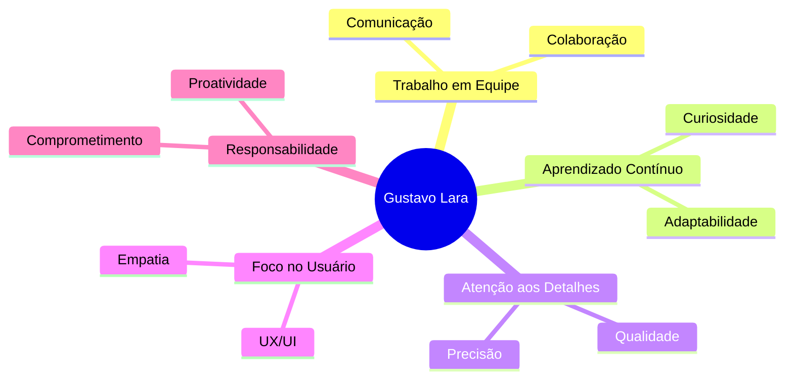

<div align="center">

# 👋 Olá, eu sou o Gustavo Lara


[](https://www.instagram.com/_gustavolara_/)
[](https://www.linkedin.com/in/gustavo-lara-26102006www)
[](https://gustavo-lara.vercel.app/)
[](mailto:gustavolara63719@gmail.com)


</div>

---

## 👨‍💻 Sobre Mim

```typescript
const gustavo = {
  nome: "Gustavo Lara",
  cargo: "Desenvolvedor Full Stack",
  localização: "Campinas, São Paulo 🇧🇷",
  idade: 19,
  foco: ["Back-End", "Front-End", "Cloud Computing"],
  atualmenteFazendo: "Cursando GTI na Fatec",
  objetivo: "Construir soluções escaláveis e impactantes",
  hobbies: ["Programação", "Aprender novas tecnologias", "Games"]
};
```

🚀 Sou um desenvolvedor apaixonado por criar soluções tecnológicas completas e eficientes. Com experiência em **desenvolvimento full stack**, trabalho tanto no **back-end** quanto no **front-end**, sempre buscando as melhores práticas e tecnologias mais modernas do mercado.

💡 Acredito no poder da tecnologia para transformar ideias em realidade e estou sempre em busca de novos desafios que me permitam crescer profissionalmente.

---

## 🛠️ Tech Stack

### 💻 Linguagens de Programação

<div align="center">


</div>

### 🎨 Front-End

<div align="center">


</div>

### ⚙️ Back-End

<div align="center">


</div>

### 🗄️ Banco de Dados

<div align="center">


</div>

### ☁️ Cloud & DevOps

<div align="center">


</div>

### 🔧 Ferramentas & IDEs

<div align="center">


</div>

### 📋 Metodologias & Gestão

<div align="center">


</div>

---

## 💼 Experiência Profissional

### 🚀 Projetos & Realizações

- ✅ **Aplicações Full Stack** com React + NestJS + MySQL + Docker
- ✅ **Arquitetura MVC** em PHP com PDO para manipulação segura de dados
- ✅ **APIs RESTful** escaláveis e bem documentadas
- ✅ **Integração de sistemas** e microserviços
- ✅ **Deploy de aplicações** em cloud (Azure, Vercel)
- ✅ **Trabalho com metodologias ágeis** (Scrum, Kanban)

---

## 🎓 Formação Acadêmica

<table>
<tr>
<td width="50%">

### 📚 Graduação
🎓 **Gestão da Tecnologia da Informação (GTI)**  
📍 Fatec  
📅 Fev 2025 – Presente

</td>
<td width="50%">

### 🔧 Técnico
🎓 **Análise e Desenvolvimento de Sistemas**  
📍 SESI / SENAI  
📅 2022 – 2024

</td>
</tr>
</table>

### 🌍 Idiomas
- 🇧🇷 **Português** - Nativo
- 🇺🇸 **Inglês** - Em andamento (Open English - Set 2025)

---

## 📜 Certificações

<div align="center">

| Certificação | Instituição | Badge |
|:---:|:---:|:---:|
| **Microsoft AI-900** | Microsoft |  |
| **Microsoft AZ-900** | Microsoft |  |
| **Modelagem de Dados** | Fundação Bradesco |  |

</div>

---

## 💪 Soft Skills

<div align="center">



</div>

---

## 📊 Estatísticas GitHub

<div align="center">


</div>

<div align="center">

[](https://git.io/streak-stats)

</div>

<div align="center">


</div>

---

## 🏆 Conquistas GitHub

<div align="center">


</div>

---

## 🌐 Conecte-se Comigo

<div align="center">

| Plataforma | Link |
|:---:|:---:|
| 📷 **Instagram** | [@_gustavolara_](https://www.instagram.com/_gustavolara_/) |
| 💼 **LinkedIn** | [Gustavo Lara](https://www.linkedin.com/in/gustavo-lara-2950a32b3/) |
| 🌐 **Portfolio** | [gustavo-lara.vercel.app](https://gustavo-lara.vercel.app/) |
| 📧 **Email** | gustavolara63719@gmail.com |
| 💻 **GitHub** | [@gustavo-lara](https://github.com/gustavo-lara) |

</div>

---

<div align="center">

### 💭 Frase de Impacto

> *"O código é poesia em movimento. Cada linha é uma chance de criar algo extraordinário."*

---

### ☕ Apoie meu Trabalho

Se você gostou dos meus projetos, considere me apoiar!

[](https://www.buymeacoffee.com/gustavolara)

---


**✨ Obrigado pela visita! Vamos construir algo incrível juntos! 🚀**

</div>
